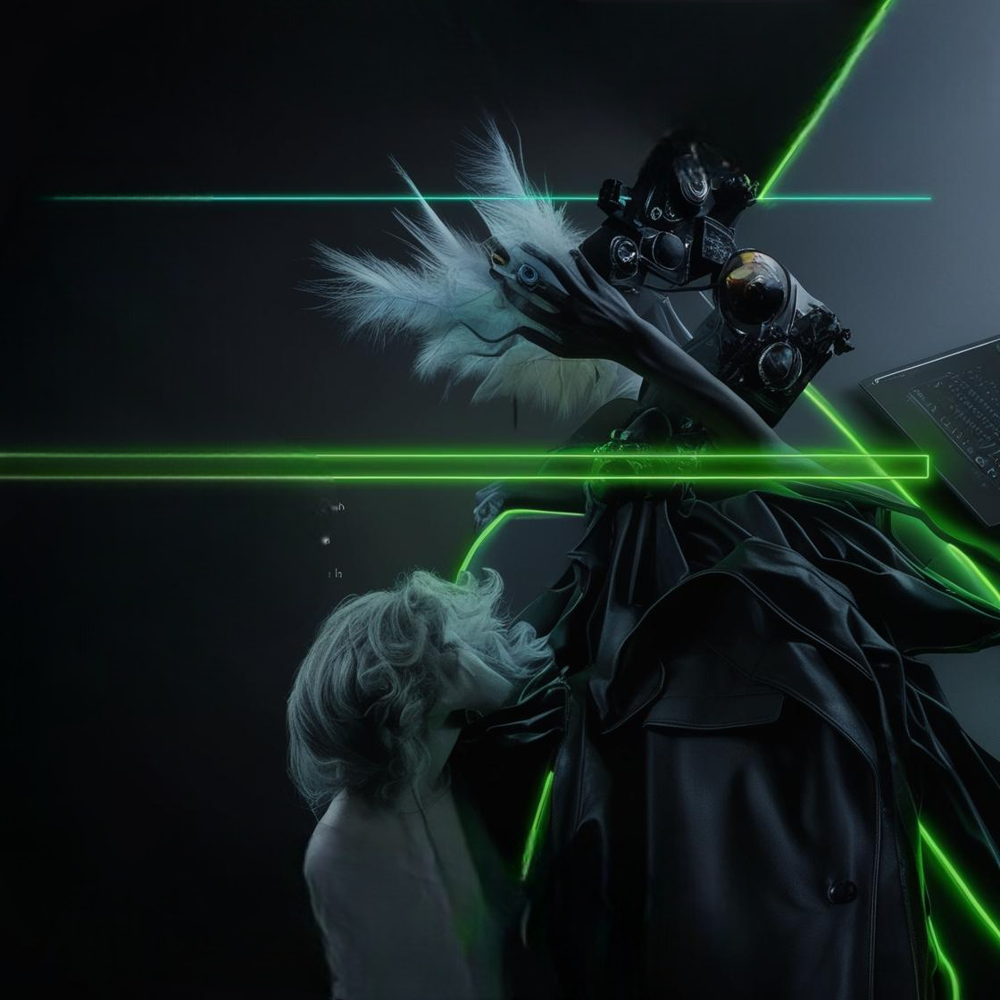

# 💼 Umer Memon - Web Developer Portfolio

Welcome to my personal portfolio website! This is a fully responsive, modern portfolio built with **HTML**, **CSS**, and **JavaScript** — designed to showcase my projects, skills, and contact information in a sleek and interactive way.

## 🔗 Live Demo

👉 [devumer.netlify.app](https://devumer.netlify.app)

## 📂 Features

- ⚡ Responsive layout for all screen sizes
- 🎯 Clean, minimal design focused on content
- 🧠 Smooth scrolling navigation
- 🧩 Project cards with live links and descriptions
- 📄 Resume download button
- 📱 Mobile-friendly hamburger menu
- 🎨 Custom styling with modern fonts and colors

## 🚀 Technologies Used

- HTML5
- CSS3 (Flexbox, Grid)
- JavaScript (Vanilla)
- Font Awesome (icons)
- Google Fonts (Inter)

## 📬 Contact Me

- 📧 **Email:** umery101@gmail.com  
- 📱 **Phone:** +92-3352110872  
- 🌐 **Portfolio:** [devumer.netlify.app](https://devumer.netlify.app)  
- 💼 [LinkedIn](https://www.linkedin.com/in/umer-yt-8932b1315/)  
- 🐱 [GitHub](https://github.com/Unknownmemon)  
- 🌐 [Facebook](https://web.facebook.com/umer.memon.974981)

## 📃 License

This project is open source and free to use under the [MIT License](LICENSE).
